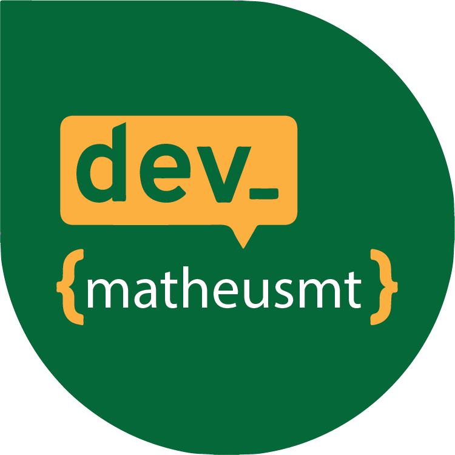

## Olá, meu nome é Matheus Teixeira!
 

 

 Sou <strong>Desenvolvedor Backend</strong> na Devnine. Responsável por arquitetar e construir APIs para nossos clientes.

  Linguagens: <strong>Typescript</strong> e <strong>Golang</strong>.

   Banco de Dados: <strong>Redis</strong> e <strong>PostgreSQL</strong>.

  Outros: Docker, Kubernetes, CI/CD.

 

<strong>Contatos:</strong>

  
  

